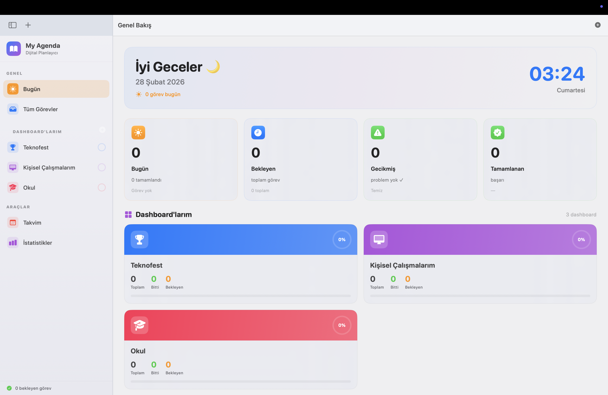
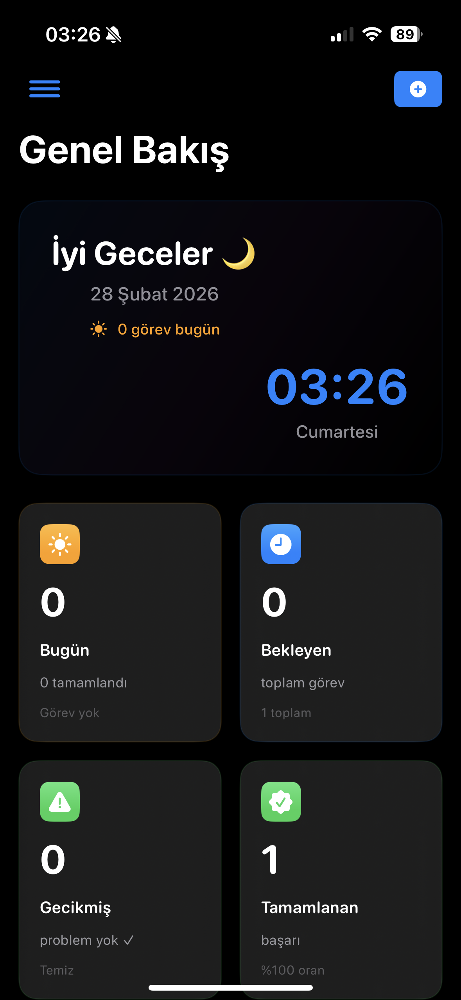
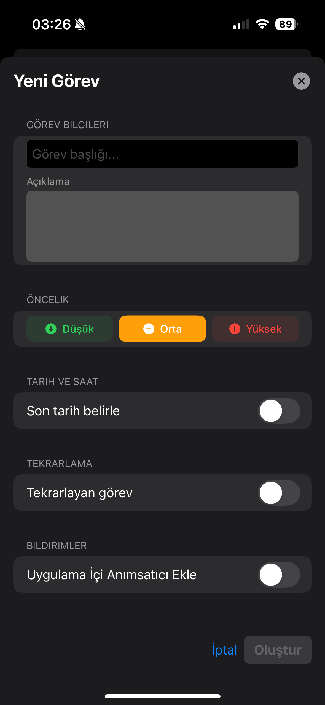
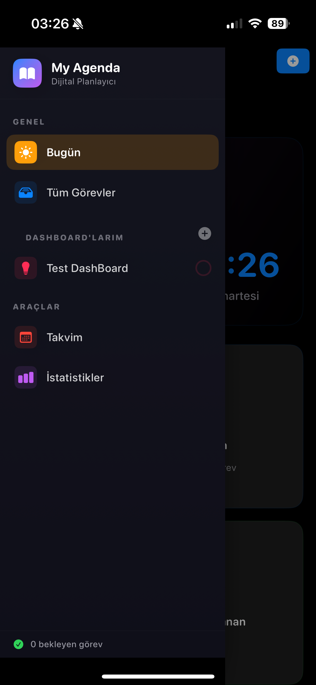
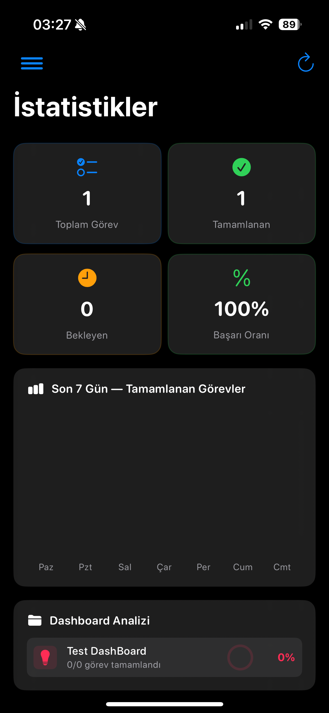
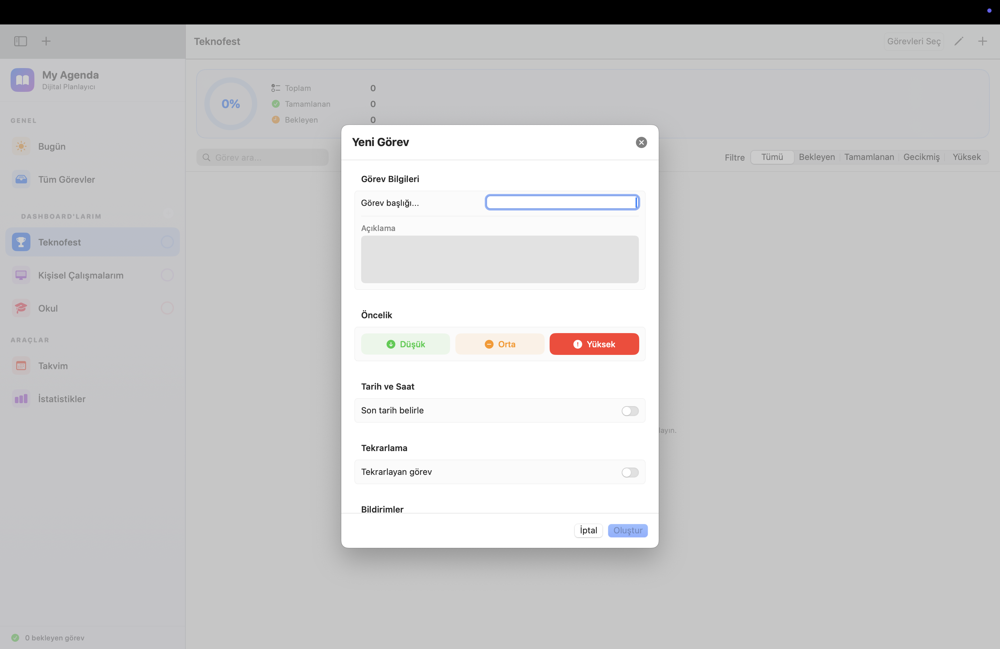

# My Agenda 📋✨

**My Agenda**, macOS ve iOS platformları için sıfırdan tasarlanmış, Apple ekosistemine tam uyumlu, modern ve kristal netliğinde bir kişisel yönetim uygulamasıdır. Günlük görevlerinizi, projelerinizi ve ajandanızı tek bir merkezden, premium bir kullanıcı deneyimiyle yönetmenize olanak tanır.

<p align="center">
  
</p>

---

## 📱 iPhone 16 & iOS İçin Ultra Optimizasyon

Uygulama, en yeni iPhone modellerinde (iPhone 16 ve Pro serisi) kusursuz çalışacak şekilde optimize edilmiştir.

<p align="center">
  
  
  
  
</p>

- **İnteraktif Kayan Menü (Swipe to Open):** Ekranın sol kenarından parmağınızı kaydırarak erişebileceğiniz akıcı ve modern sidebar deneyimi.
- **44x44 Dokunmatik Standartlar:** Tüm butonlar ve etkileşimli alanlar Apple'ın erişilebilirlik standartlarına uygun olarak tasarlanmıştır.
- **Hız ve Yumuşaklık:** iOS'in yüksek yenileme hızına (ProMotion) tam uyumlu, yaylı (`spring`) animasyonlar ile yağ gibi akıcı geçişler.

---

## 💻 macOS Deneyimi

Mac kullanıcıları için gerçek bir "Native" deneyim sunar.

<p align="center">
  
</p>

- **3 Sütunlu (Three-Column) Layout:** Sidebar, içerik listesi ve detay paneli ile masaüstü verimliliğini maksimize eder.
- **Mac'e Özel Kısayollar:** `Enter` ile kaydetme, `Esc` ile çıkma gibi yerleşik klavye desteği.
- **Dinamik Pencere Yönetimi:** Pencere boyutuna göre otomatik olarak şekil değiştiren akıllı arayüz.

---

## 🚀 Öne Çıkan Özellikler

- **Dashboard Sistemi:** Görevlerinizi kategorize edin ve projelerinize göre Dashboard'lar oluşturun.
- **Akıllı Takvim Görünümleri:**
  - **Aylık Takvim:** Tüm ayı tek bakışta görün, görev yoğunluğunu takip edin.
  - **Haftalık Ajanda:** Haftalık planınızı detaylı saat aralıklarıyla (Time-Blocking) yönetin.
- **Gelişmiş Görev Yönetimi:**
  - **Tekrarlayan Görevler:** Günlük, haftalık, aylık veya belirli günlere özel (Pzt, Çar vb.) tekrarlar oluşturun.
  - **Önceliklendirme:** Yüksek, orta ve düşük öncelik etiketleriyle acil işlerinizi belirleyin.
- **Apple Takvim & Bildirimler:** Görevlerinizi Apple Calendar ile (Opsiyonel) senkronize edin ve sistem bildirimleriyle hiçbir şeyi unutmayın.
- **Premium İstatistikler:** Verimliliğinizi görsel grafiklerle (Apple Charts) takip edin.

---

## 🛠 Teknoloji Yığını

- **Dil:** Swift 5.10+
- **Framework:** SwiftUI (Modern, Declarative UI)
- **Veri Yönetimi:** SwiftData (Kalıcı ve yerel veri saklama)
- **Grafikler:** Swift Charts
- **Mimari:** Clean Architecture (MVVM)

---

## 📦 Kurulum ve Geliştirme

1. Bu depoyu klonlayın:
   ```bash
   git clone https://github.com/berraakman/My-Agenda.git
   ```
2. `My Agenda.xcodeproj` dosyasını Xcode 15.0+ ile açın.
3. iPhone veya Mac target'ını seçin.
4. `⌘ + R` tuşlarına basarak uygulamayı çalıştırın.

*(Not: iCloud senkronizasyonunu aktifleştirmek için "Signing & Capabilities" altından CloudKit'i kendi Bundle ID'niz ile etkinleştirmeniz gerekmektedir.)*

---

## 🎨 Tasarım Estetiği
Uygulama, Apple'ın modern tasarım dili olan **Glassmorphism** ve **Vibrant Colors** üzerine inşa edilmiştir. Koyu mod (Dark Mode) desteği ile göz yormayan, premium bir görünüm sunar.

---

## 📄 Lisans
Bu proje **Berra Akman** tarafından geliştirilmiştir. Tüm hakları saklıdır.

---

**Geliştirici:** [Berra Akman](https://github.com/berraakman)
